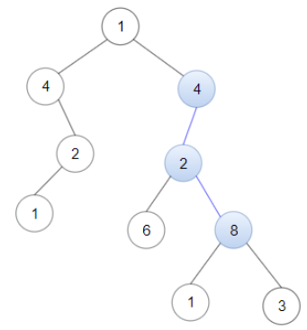
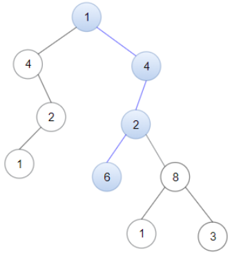

# 题目

Given a binary tree root and a linked list with head as the first node.

Return True if all the elements in the linked list starting from the head correspond to some downward path connected in the binary tree otherwise return False.

In this context downward path means a path that starts at some node and goes downwards.

#### Example1:


```
Input: head = [4,2,8], root = [1,4,4,null,2,2,null,1,null,6,8,null,null,null,null,1,3]
Output: true
Explanation: Nodes in blue form a subpath in the binary Tree.
```

#### Example2:



```
Input: head = [1,4,2,6], root = [1,4,4,null,2,2,null,1,null,6,8,null,null,null,null,1,3]
Output: true
```

#### Example3:
```
Input: head = [1,4,2,6,8], root = [1,4,4,null,2,2,null,1,null,6,8,null,null,null,null,1,3]
Output: false
Explanation: There is no path in the binary tree that contains all the elements of the linked list from head.
```

#### Constraints:
* 1 <= node.val <= 100 for each node in the linked list and binary tree.
* The given linked list will contain between 1 and 100 nodes.
* The given binary tree will contain between 1 and 2500 nodes.


# Python3 Solution
## 解题思路1：
暴力匹配法，先匹配根节点，然后再匹配左右节点，对每一个节点进行路径比对

```
# Definition for singly-linked list.
# class ListNode:
#     def __init__(self, x):
#         self.val = x
#         self.next = None

# Definition for a binary tree node.
# class TreeNode:
#     def __init__(self, x):
#         self.val = x
#         self.left = None
#         self.right = None

class Solution:
    def isSubPath(self, head: ListNode, root: TreeNode) -> bool:
        if not head:
            return False
        if not root:
            return False
        return self.dfs(head, root) or self.isSubPath(head, root.left) or self.isSubPath(head, root.right)

    def dfs(self, head, root):#递归中比较
        if not head:#链表走到头
            return True
        if not root:#树走到头
            return False
        if head.val != root.val:#当前节点
            return False
        return self.dfs(head.next, root.left) or self.dfs(head.next, root.right)
```

## 解题思路2：
KMP字符串匹配算法
构建dp数组，dp[i]表示链表A的index i这个位置及其以前，存在的首尾相同的最大字符串个数，若链表A的第i个值比较后不相等，则链表A移动i-dp[i-1]位，A的第i个值和A[i-(i-dp[i-1])] = A[dp[i-1]]进行比较，i不等于0，i等于0时不相等的时候要移动1位，即KMP算法


```
class Solution:
    def isSubPath(self, head, root):
        def dfs(root, i):#递归匹配。方法分解，和linkListVal[i]中的元素比较，移动dp[i-1]步
            #递归出口
            if not root: #当前节点为空
                return False

            #当前节点进行比较
            while i and root.val != linkListVal[i]:
                i = dp[i - 1]#链表作为模板移动 i往小走
            #若相等 则证明有i个元素首尾重复相等
            i = i + (linkListVal[i] == root.val)#再判断一下当前节点是否与链表相等  确定下一次和哪个linkListVal[i]比较  i往大走
            if i == len(dp):#最后一个节点进行比较，相同之后存在返回true
                return True
            res = dfs(root.left, i) or dfs(root.right, i)#移动dp[i-1]步继续比较
            return res

        dp, linkListVal = [], []#链表结构变成列表可以支持随机索引访问
        dp.append(0)#从0开始递推
        node = head
        while node:
            linkListVal.append(node.val)
            node = node.next
        #遍历链表构建dp数组
        i = 0#保证i在循环中一直存在
        for j in range(1, len(linkListVal)):#寻找首尾最大匹配字符数目
            while i and linkListVal[j] != linkListVal[i]:
                i = dp[i - 1]#根据对称性质更新下标i在dp[i - 1]的位置上是否相等，递归求解
            i += linkListVal[j] == linkListVal[i]#i个数字首尾相等，再加上最后一个可能是0或1
            dp.append(i)
        return dfs(root, 0)
```
