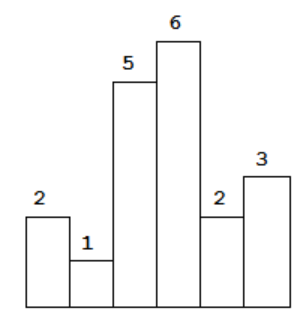
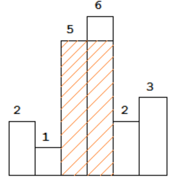

# 题目
Given n non-negative integers representing the histogram's bar height where the width of each bar is 1, find the area of largest rectangle in the histogram.



Above is a histogram where width of each bar is 1, given height = [2,1,5,6,2,3].



The largest rectangle is shown in the shaded area, which has area = 10 unit.

#### Example 1:
```
Input: [2,1,5,6,2,3]
Output: 10
```

# Python3 Solution
## 解题思路：
这个题是单调栈的运用，使用一个单调递增栈来维护已经出现了的矩形高度，如果后面新来的元素高度比栈里最后的元素高，那么需要入栈，因为面积最大的元素会出现在后面。如果后面新来的元素高度比栈里的最后的元素小，那么需要弹出栈里的元素，并且，每次弹出的时候都要对计算目前的宽度，相乘得到面积。栈里保存索引的方式是需要掌握的，保存索引的方式在最小值栈结构中也有运用。每次求栈内矩形的高度的时候，其实是求其位置到最右边的距离。注意即将入栈的元素索引i是一直不变的，另外栈里的每个元素的索引可以认为是矩形的右边界。
```
class Solution:
    def largestRectangleArea(self, heights: List[int]) -> int:
        stack = [0]#保存索引从0开始
        heights.append(0)#加入0，方便最后的时候计算单调递增的矩形的面积
        res = 0
        for i in range(1, len(heights)):#从1到heights index -1
            if(heights[i]>=heights[stack[-1]]):#最大矩形的右边界不确定
                stack.append(i)#存储当前矩形下标，为当前最高矩形下标
            else:
                while stack and heights[i]<heights[stack[-1]]:
                    h = heights[stack[-1]]#当前最高矩形的高度
                    stack.pop()#这些矩形下标没用了需要弹出
                    w = i if not stack else i-1-stack[-1]#计算宽度找右边界。如果栈为空了，w=i最低矩形高度乘以总宽度
                    res = max(res, w*h)
                stack.append(i)
        return res                
```
